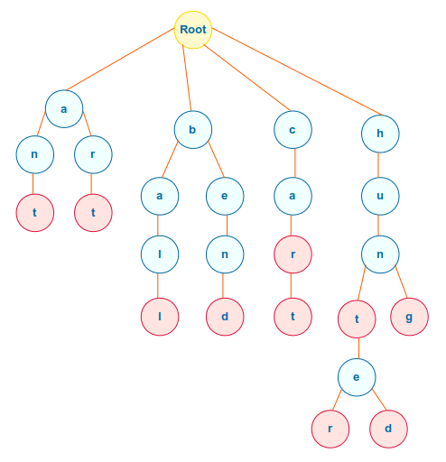

# Introduction

Hello everyone! in this first blog series I will be detailing how Antivirus detection works and how to implement their basic functionality. Being a computer science student, I wanted to incorporate the Data structures and Algorithms I learned into something practical, something that I can use in real life and has *practical use.* Antivirus became an attractive topic to me because of the way its deeply linked with systems and OS internals, which is also another topic that I was interested in.

Malware detection can usually be split into two componenents, static and dynamic analysis. Static analysis is basically the simplest step that Antiviruses use to detect malicious code. This contains scanning the file-content such as it's headers, strings, file information etc. without actually opening the file. It's essentially taking file at face value and comparing it to a what it knows is malicious to determine if the file is malware or not.

Dynamic analysis on the other hand, is way more complicated. It involves dynamically running the code and analyzing the behaviour to see if its malicious or not. Is the file connecting to any suspicious links? Does the file allocate and copy any suspicious things at runtime? Does the file try to access any suspcious things? etc. Dynamic analysis is also more complicated as it may try to incorporate machine learning too.

Most Antivirus solutions are usually built into the OS kernel or ran with high privileges. This is so that they have access to all the resources in the OS and can check if any of them are suspicious processes or not. For example, you can make a kernel driver which subscribes to specific events such as process creation. Whenever a process is created, the kernel looks for a special table. In this table, are things called callback functions and the kernel will execute them all one by one. That means for example, we could create a driver which register a callback function in this table that scans the file for any suspicious things so whenever a process is created, windows calls this function and scans this process.

For the sake of simplicity, we will not be creating any of these fancy kernel drivers or services. We will instead create a simple userland python program to emulate what an antivirus would do. This also mainly focuses on windows, although you could apply the same concepts to Mac or Linux.

Now that we've gotten all the basics out of the way, let's begin our development.

## Searching For Strings

The first and most basic step that most antiviruses do is to extract any strings in the file and check againt their large database of malicious strings to see if 
the file is malcious or not. I first though about using a large hashmap to compare each string of the file too, but then I realized that this would not work out as 
expected. Let's say we have a string called "Malware" in our database, if the string "Malware" is also in our file then yay! We can match them quickly and all is well.
However, what if we have "Malware2"? Adding a simple 2 at the end effectively evades any comparison. We need a data structure that allows us to search for prefixes also.

This is when I thought about using a Trie. A trie is essentially a tree that can have as many children of possible. We can then model our words in our tree like so (A picture always explains best)



(source: https://www.polarsparc.com/xhtml/Trie-1.html)

A Trie is made up out of a series of nodes, which each node has a value and a hashmap of children. The dictionary of children has a key of a character, and the value of another node.
Technically, our node doesn't need to have a value, if we initalize an root node. We'll see how this makes sense in a bit.

Imagine we have the word "asdf". To insert the word "asdf" in our Trie, we first want to iterate throuch each of the character one by one and insert each one into the trie.
We first check if the character "a" is in the children of our root node (which we set it to be our current node to search in). The children of the root node can be seen as all the first characters of all the words in the trie.
If it does not exist, we create a key, value pair in the hashmap with a being the key and an empty node as the children. If we do find it however, we don't do anything, and we just
set our current node to search in to the value given by the key in our hashmap, which should be a Node based on how our data structure works.

Notice how if a character does not exist in our dictionary, we keep on creating a nodes for each character in the dictionary until we reach the end of the word. This is because if the first letter of the word
does not exist in the Trie, then the whole world can't exist in the tree! (see how that makes sense?). 

Once we reach the end of the word to insert, i.e our word is empty, then we set the current node to indicate that it is the end of the word, so when we search for a word later in the trie we know that we can
stop traversing the trie.

Notice how there is no set amount of children nodes that each parent must have, it can be any amount. 

The basic code is shown below:

``` python

# A trie is a tree-like data structure that stores a dynamic set of strings.
# Tries are commonly used to store the entire English language in a way that is more efficient compared to other data structures like a hash table. A trie is a tree structure where each node represents a single character of a string. Each node can have multiple children, and the path from the root to a node represents a string. The root node will have an empty string, and each child node represents a single character of a string.
# The trie data structure is used to store strings that can be searched in O(M) time complexity, where M is the length of the string.
class TrieNode:
    def __init__(self):
        self.children = {} # We will use a hashmap to store the children nodes, the key of the hashmap is some character from a-z, each character maps to some TrieNode
        self.isEndOfWord = False

class Trie:
    def __init__(self):
        self.root = TrieNode() # the root is a Trienode.
    
    def insert(self, word):
        curr = self.root
        for c in word:
            if c not in curr.children: 
                curr.children[c] = TrieNode() 
            
            curr = curr.children[c] # we skip to the next, becuase the character already exists in the trie.
                
        
        # Then we reach the end of the word
        curr.isEndOfWord = True

```

To search for a node however ...

``` python

    def search(self, word):
        curr = self.root
        for c in word:
            if c not in curr.children:
                return False
            
            else: # it is in children, so we want to go to that node and search for the rest of the word
                curr = curr.children[c]
        return True

```

This essentially follows the same logic as inserting, except if there is no character in the children, then we just return false, and keep searching the children.

The intersting part of this was how I needed to combine this with searching a large string. Tackling our problem if we had a looooong string like: "asdghaksdgjkasldg;j asmalwareasdghaskdgj", then how would we search this?

I first thought about doing this with a two-pointer. Having grinded some l33tcode, I recognized how we would use two-pointers to solve this, how I implemented this is shown below:

``` python
 def search_in_tree(self, text):
        matches = []
        l = 0
        
        for l in range(len(text)):
            curr = self.root # everytime, we want to go to the end
            for r in range(l, len(text)):
                c = text[r]
                if c not in curr.children:
                    break
                curr = curr.children[c] # remember the c key is the character, and the value is the TrieNode
                
                if curr.isEndOfWord: # the c key has a node that is the term end, and that c = r, so we take all the charaacters form l to r inclusive!
                    matches.append(text[l:r+1]) 
                    l = r # sliding window!
                    break 
                    
        
        return matches

```

We first initalize a left and a right to point to the start of the string. We first check, is the right in the children of the current node(which for the first iteration will be our root node), if not then we move our left up one and the for loop continues (remember that r starts at the l index, so whenever they dont match l and r both point to l+1 in the array now). If the character does match the current node's children, great! We then increment our r to point to the next character in the string, while keeping our left pointer constant. We keep on doing this until a character does not exist in a current node's children anymore, or until we can find a whole word in the tree (yay!), if it does, then we know that the string from index l to index r must include a word that is in our trie. So then we append that to our list of matches.

If we reach the end of the word, we also move our left poitner up alll the way to our r. The reason we do this is because we already know every character from the left pointer to right pointer already exists in the trie, so there's no use checking those characters anymore, checking them would just be a waste of time.

Now, I'm pretty sure that this is not the most efficient way of doing so ... If anyone wants to teach me more efficient ways to search a long string to a trie feel free to email me at k499wang@uwaterloo.ca.

## Hashmaps

That's basically it for our string searching, but our AntiVirus won't just stop there, we will also compare the hashsum of our file to a database of malicious hashsums.

A hash of a file is essentially the file's fingerprint calculated with all sorts of math. Just a miniscule change to the file is enough to change the file's hash completely. If we already know a file's malicious, we can compare the hashes of the file to see if they are the same file. This has tons of advantage comapared to comparing each byte of the file to see if the file is the same or not.

To do this, I implemented a wrapper around a hashmap to check and insert values from a text file.

``` python
import hashlib

class AntiHashMap:
    def __init__(self):
        self.hashMapDB = {}
    
    def insert(self, key, value):
        self.hashMapDB[key] = value
    
    def search(self, key):
        if key in self.hashMapDB:
            return self.hashMapDB[key]
        return None

    def output(self):
        for key, value in self.hashMapDB.items():
            print(f"{key} : {value}")

    def insert_file(self, filename, value):
        hash_function = hashlib.new("sha256")
        
        try:
            with open(filename, "rb") as i:
                while chunk := i.read(8192):
                    hash_function.update(chunk)
        except Exception as e:
            print(f"An error occurred: {e}")
            return False

        self.insert(hash_function.hexdigest(), value)
        
        return True
        
    def insert_database(self, filename):
        try:
            with open(filename, "r") as i:
                for line in i:
                    key, value = line.split(":")
                    self.insert(key, value)
                    
        except Exception as e:
            return False

```

Now for actually extracting the strings from the file, I couldn't find a nice and easy solution to do so (I tried to do so with parallelism, splitting chunks, overlapping chunks etc.) But that became tooo messy. So I opted for using a built in python library instead.

``` python

def extract_strings(filename):
    strings = []
    try:
        with open(filename, "rb") as i:
            data = i.read()
            for (string) in b2s.extract_all_strings(data):
                strings.append(string[0].strip())
    except Exception as e:
        return e
    
    return strings

```
Okay! So we have our functionality done (the basic parts at least). You can test the code here and switch to the Main Functionality Branch: https://github.com/k499wang/CustomAV

Let's run a test and see if it works or not.

``` powershell
python3 main.py -f C2ImplantSrc.exe

...


dalone=\'yes\'?>\r\n<assembly xmlns=\'urn:schemas-microsoft-com:asm.v1\' manifestVersion=\'1.0\'>\r\n  <trustInfo xmlns="urn:schemas-microsoft-com:asm.v3">\r\n    <security>\r\n      <requestedPrivileges>\r\n        <requestedExecutionLevel level=\'asInvoker\' uiAccess=\'false\' />\r\n      </requestedPrivileges>\r\n    </security>\r\n  </trustInfo>\r\n</assembly>']
WE FOUND MALWARE: [['k3vin'], ['min_exp'], ['athena'], ['k3vin']]
```


Yay! It works. The code I'm using is the beacon code for a simple C2 server I made. Github here btw: https://github.com/k499wang/C2ImplantSrc/tree/master/C2ImplantSrc

# Conclusion

So that's basically it for our string searching algorithms. It's not that functional yeah, but it's a quick POC to what we are going for next.

Part 2 Will include Bypass techniques including XOR encryption.
Part 3 Will include API Hooking to detect malicious arguments at runtime.
Part 4 will include how to Bypass those Hooks. 

Stay tuned for more.